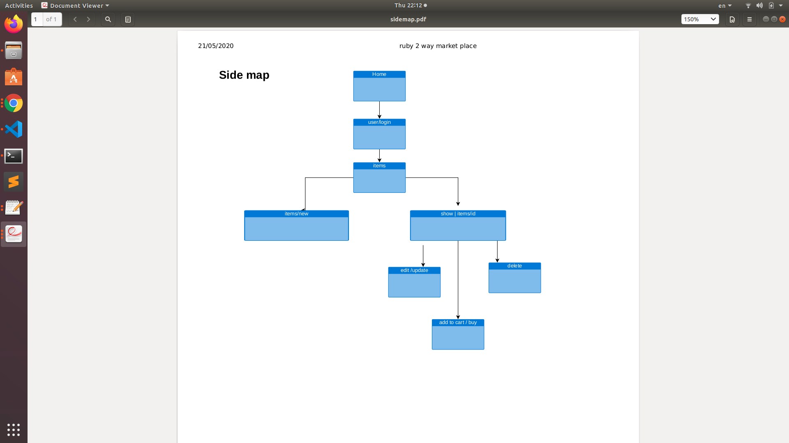
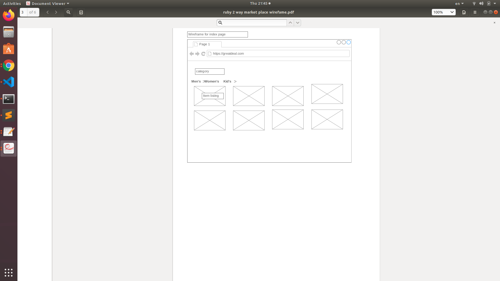
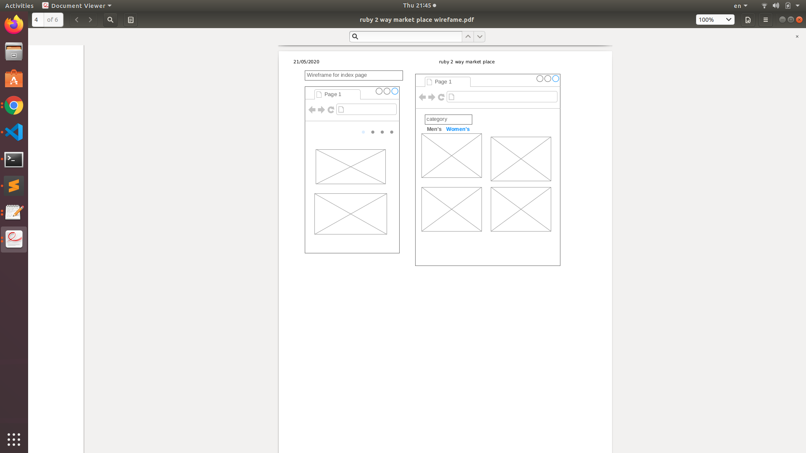
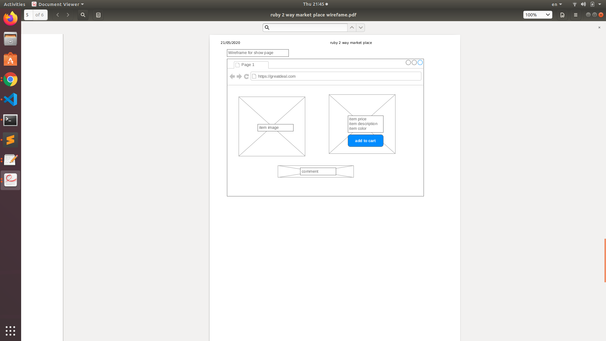
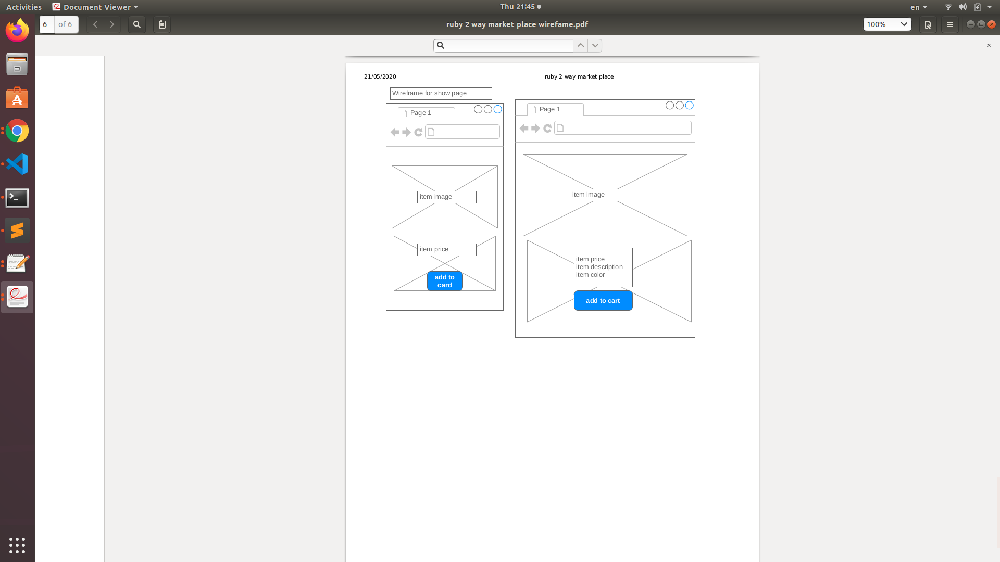
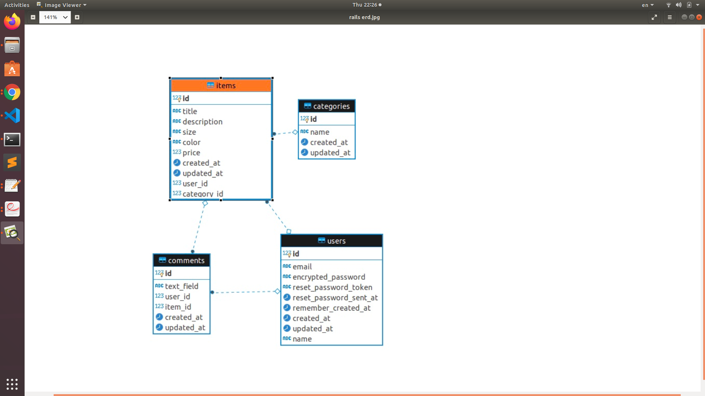

Github: https://github.com/Patriciapavia/ruby-2-way-market

Website: https://greatdeal.herokuapp.com/

# Introduction

This ruby on rails two sided marketplace, i name the website greatdeal the idea of it is buyer and seller can get a greatdeal. This app will cater to two markets that brings together buyers & sellers.

# What is the problem i trying to solve by building greatdeal marketplace app ?

  Usually working people are very busy after finish work they might be too tired to go nomal shopping, so online shopping could help these people to buy what they want and get it to delivery on the door. online shopping could save more money and time as well for example a cost to travel to shopping center and time shopping around the shops.

# Purpose

The purpose of building this app is to facilitate interaction between providers and customers. The two user groups can find each other and exchange value on a trustworthy platform, and the platform – typically – charges a commission or another kind of each transaction.

# Functionality / features

- Users can buy and sell product.
- Anyone can view the listings, including the price and condition of individual listings.
- Anyone an search the listings for a specific product
- The prices of all listings of the same product are displayed on the show page and also index page for that product
- Only users who create that listing can edit or delete listing
- Security has been added to prevent users from editing or deleting listings which are not theirs.
- When listing a new product for sale, users can select which category after that product will display on each individual category.
- Secure payment through Stripe
- user who login can create comment on any product
- between buyer and seller can send each other messages

# Target audience

- People who already own an ecommerce store or newbies who wish to start a store.
- Older people who are working as they have a credit card from which they can pay for their goods. They use it because they come back late from work and so shopping is very tiring, consequently they turn to online shopping where their items are delivered to them.

# The following were used in the creation of Greatdeal marketplace:

- Ruby
- Rails
- Gems: Devise, active-storage, pg, bootstrap.
- Postgres database
- HTML
- CSS
- Heroku
# Side map

# Wireframe

# ERD

# user stories for my app

1. As a seller, I want to be able to buy individual product, so I don't have to go shoping.

Implication: users should be able to view the details of individual product before purchase, rather than buying without knowing the identity of the product.

2. As a player, I want to be able to sell product.

3. As a buyer, I want to be able to search all listings, so I may find the individual product I need

Implication: search functionality for listings should exist.

4. As a buyer, I want to be able to filter from category
  Implication: filter functionality for listings should exist.

5. As a seller, I want to be able to see the prices that a product is selling at, so that I may set an appropriate price

Implication: as much detail on transaction prices should be provided as possible. Ideally this would include a price history over several months. However considering the scope of the project, the feature to be implemented is that users can see the prices of all cards currently listed.

6. As a seller, I want to be able to modify my listing after it is posted, so that I may correct any mistaken details I have entered

Implication: edit functionality should exist to change details of the listing, or even remove the listing completely.

7. As both a buyer and a seller, I want the site to handle payment, so I don't have to worry about it

Implication: a reputable third-party payment gateway such as Stripe should be used on the site.

8. As a seller, I want the website to identify the full card information with as little input from me as possible, so I don't have to manually enter all the details myself

- As both a buyer and a seller, They can message each other between the site.

- As both a buyer and a seller, They can see and make comment on every product.

9. As a user, no one should be able to edit my profile or buy or sell under my profile, so I have control over my activity on the site

10. As a seller, no one should be able to edit my listings but me, so I have control over what I am selling

Implication: an authentication system must exist which restricts users from accessing or editing certain information.

# explained the different high-level components (abstractions) in my app

The components of the application
Greadeal-marketplace is written using Ruby on Rails and the PostgreSQL database. The application utilises the model-view-controller (MVC) model to create separation of concerns and applies a RESTful API to define which methods are available on which endpoints.

This section will explain the different high-level abstractions in the app:

- database
- routes
- model
- view
- controller

The database

  The role of the database is to hold the data. This is necessary so that data is persistent between sessions. Without a database, information can only be saved in variables, which are temporary memory storage. This means that when a user closes the app and re-opens it, their data would be lost. Data is saved in the database in rows and columns. A page of rows and columns, analogous to a spreadsheet is called a table. Some of the tables included in great-marketplace are items and users, which store information regarding items and users respectively. The columns within a database are called attributes and the rows are called records.

Routes

Routes are important for the rails application because they direct where information should flow between the models, controllers, and views, and which HTTP verbs are available on which endpoints. The routes are arranged in rails using RESTful API architecture.

Routes are declared in the 'routes.rb' file in the config directory. The verbs, controllers, and methods declared in the routes file determines which controllers, methods within those controllers, and views must be created.

The model

The database is accessed via the model, which has the responsibility of interfacing with the database and passing the information along to the controller. In Rails, the model must be named the singular version of the table to which it refers. For example the model for the items table must be called 'item.rb' by convention and placed in the app/models directory. The model should inherit from the ApplicationRecord class.

The view

The role of the view is to display information to users. Therefore each webpage will have a view. Views are intended to contain very little logic, with only simple conditionals being acceptable. 
By convention, views are saved in the apps/views directory, and then inside another directory with the name of that page's controller. For example if the model was called 'item.rb', the controller would be called 'items_controller.rb' and a directory named 'items' would need to be created in apps/views, then any pages accessed through 'items_controller.rb' would be saved in app/views/items. These files would then have the name of the methods within the controller. Following on from our example, if there was a method called 'show' in 'cards_controller.rb', the view would be called 'show.html.erb'.

The controller

The controller contains the logic of the program and is responsible for connecting the model and view, meaning showing the information retrieved from the database to the user.

# listed and described any third party services that your app will use

Third-party services MTG-marketplace uses
The following third-party services were used either in the development or the running of MTG-marketplace:

* Devise gem
* PostgreSQL
* Heroku

Devise gem
Devise is a Ruby gem which provides a flexible authentication solution. In greatdeal-marketplace, Devise was used to generate the users table in the database, user model, controllers (not in the rails files), and views relating to signing in, registering, and resetting passwords.

One of the most important functions of Devise is to make the 'current_user' variable available, which makes it much easier to attach other objects such as listings, addresses, and images to a specific user. 'current_user' can also be used to display different information to different users depending on which user is logged in.

PostgreSQL
PostgreSQL was the databased used for MTG-marketplace. PostgreSQL is a free, open-source, relational database. PostgreSQL can be easily integrated with a rails application when the application is created by typing.

rails new project_name -d postgresql

Heroku
The application is hosted using the cloud hosting provider Heroku. Heroku provides instructions for how to deploy a rails application on the platform, making the deployment easy for the purpose of this project. Lastly, Heroku can also be synchronised with the repo on github, which allows any updates pushed to github to be immediately reflected on the website hosted using Heroku.

# Task planning and tracking

### Stage 1. Planning
The first tasks completed were those involved in the planning stage of the project, including:

Why is this a problem that needs solving?
* User stories
* Wireframes
* ERD

relationships between tables
Each of these steps of the project were completed before the rails project was even created. These features were completed first in the order listed above because the features of the website, and the database structure serve as the foundation for all other parts of the project.

### Stage 2. Developing the database
In this stage, code was written for the following:

* generating the database migrations
* writing the associations into the models

### Stage 3. Testing involved making sure the following were possible:

 * a user could be created
 * a listing could be created
 * a listing could be associated with item and a user
 * a purchase could be associated with a user and a listing
 * This involved the creation of routes, controllers, and views.

### Stage 4. Security features
After basic CRUD functionality was implemented, it was important to implement security to ensure:

* users cannot edit or delete listings which are not theirs
* users cannot access to website without sign up or login

### Stage 5. Advanced features
Once basic features were complete, the next stage was to add advanced features, including:

* category
* comment
* message

These features were left until later in the project as they were features which could be cut if there was no time to develop them, but they were in the original plans. these features are present in the final version of great-marketplace. but the category seem to have problem on heroku site its working perfectly fine on localhost.

### Stage 6 styling with CSS
 making website looking good for user interface, but only finished home and index and some on show, running out of time. would continue to work more afer submit the project.
